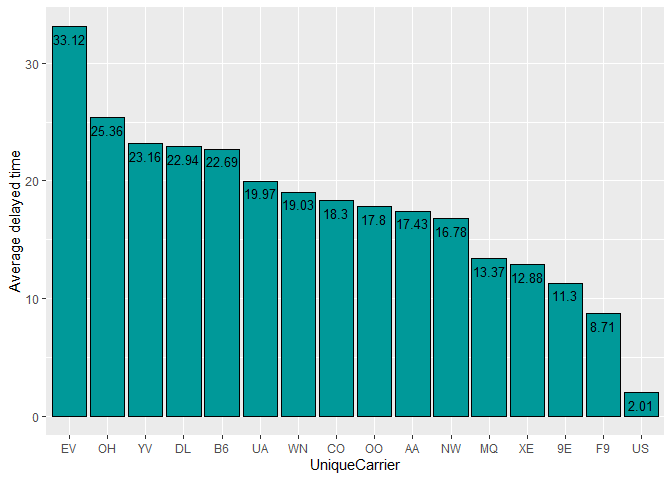
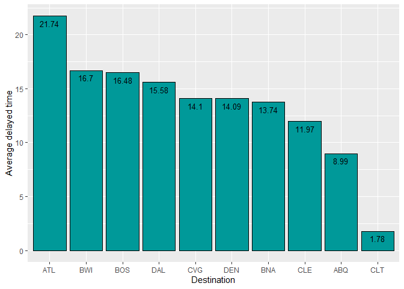

Austin-Bergstrom Interational Airport - Visualization
================

``` r
abia = read.csv('ABIA.csv', header=TRUE)
abia = abia[,-1]
abia$ElapsedDelay = abia$CRSElapsedTime - abia$ActualElapsedTime
abia$TotalDelay = abia$ElapsedDelay + abia$ArrDelay + abia$DepDelay
abia$depart = ifelse(abia$Origin=='AUS','Depart','Arrival')
abia$early = ifelse(abia$TotalDelay<0,abia$TotalDelay,0)
abia$delayed = ifelse(abia$TotalDelay>0,1,0)
abia$Week = ifelse(abia$DayOfWeek<5,"Weekday","Weekend")
```

## 1\) Delay by Airways

``` r
library(ggplot2)
prop = xtabs(~delayed + UniqueCarrier, data=abia) 
prop = prop.table(prop, margin=2)
prop = as.data.frame(prop)
prop = prop[prop$delayed==1,]
prop$UniqueCarrier <- factor(prop$UniqueCarrier, levels = prop$UniqueCarrier[order(-prop$Freq)])
ggplot(prop, aes(x=UniqueCarrier,y=Freq))+
  geom_bar(stat="identity", fill="#FF9999", colour="black")+
  geom_text(aes(label=round(Freq,2)), vjust=1.6, color="black",size=3.5)+
  ylab("Proportion of delayed flight")
```

<!-- -->

Atlantic Southeast Airlines(EV) has the highest delay rate with 53%
followed by Southwest Airlines(WN) with 52%. US Airways(US) has the
lowest delay rate with
22%.

``` r
prop2 = xtabs(TotalDelay~UniqueCarrier , aggregate(TotalDelay~UniqueCarrier,abia,mean))
prop2 = as.data.frame(prop2)
prop2$UniqueCarrier <- factor(prop2$UniqueCarrier, levels = prop2$UniqueCarrier[order(-prop2$Freq)])
ggplot(prop2, aes(x=UniqueCarrier,y=Freq))+
  geom_bar(stat="identity", fill="#009999", colour="black")+
  geom_text(aes(label=round(Freq,2)), vjust=1.6, color="black",size=3.5)+
  ylab("Average delayed time")
```

<!-- -->

Atlantic Southeast Airlines(EV) has also the highest average delay time
with 33 minutes followed by Comair(oh) Airlines with 25 minutes. US
Airways has the lowest average delay rate with 2 minutes.

## 2\) Delay by month

``` r
prop = xtabs(~delayed + Month, data=abia)
prop = prop.table(prop,margin=2)
prop = as.data.frame(prop)
prop = prop[prop$delayed==1,]
prop$Month <- factor(prop$Month, levels = prop$Month[order(-prop$Freq)])
ggplot(prop, aes(x=Month,y=Freq))+
  geom_bar(stat="identity", fill="#FF9999", colour="black")+
  geom_text(aes(label=round(Freq,2)), vjust=1.6, color="black",size=3.5)+
  ylab("Proportion of delayed flight")
```

<!-- -->

Months in vacation, which is December, March, June, have higher
proportion of delayed flight. However, fall season from September to
November, the rate tend to be lower.

``` r
prop = xtabs(TotalDelay~Month , aggregate(TotalDelay~Month,abia,mean))
prop = as.data.frame(prop)
prop$Month <- factor(prop$Month, levels = prop$Month[order(-prop$Freq)])
ggplot(prop, aes(x=Month,y=Freq)) + geom_bar(stat="identity")+
  geom_bar(stat="identity", fill="#009999", colour="black")+
  geom_text(aes(label=round(Freq,2)), vjust=1.6, color="black",size=3.5)+
  ylab("Average delayed time")
```

<!-- -->

Similar to the proportion of delay flight, months in vacation, which is
December, March, June, have higher delayed time. However, fall season
from September to November, the delay time tend to be lower.

## 3\) Delay by airport(Top 10)

``` r
abia_depart = abia[which(abia$depart == 'Depart'),]
prop = xtabs(~delayed + Dest, data=abia_depart)
prop = prop.table(prop,margin=2)
prop = as.data.frame(prop)
prop = prop[prop$delayed==1,]
prop$Dest <- factor(prop$Dest, levels = prop$Dest[order(-prop$Freq)])

ggplot(na.omit(prop[1:10,]), aes(x=Dest,y=Freq))+
  geom_bar(stat="identity", fill="#FF9999", colour="black")+
  geom_text(aes(label=round(Freq,2)), vjust=1.6, color="black",size=3.5)+
  ylab("Proportion of delayed flight")+
  xlab("Destination")
```

<!-- -->

Flight from Austin to Balitimore/Washington Airport has the highest
delay rate with 53%. Nashville International Airport and Dallas Airport
also have delay rate over
40%.

``` r
prop = xtabs(TotalDelay~Dest, aggregate(TotalDelay~Dest,abia_depart,mean))
prop = as.data.frame(prop)
prop$Dest <- factor(prop$Dest, levels = prop$Dest[order(-prop$Freq)])
prop = prop[which(prop$Freq>0),]
ggplot(prop[1:10,], aes(x=Dest,y=Freq)) + geom_bar(stat="identity")+
  geom_bar(stat="identity", fill="#009999", colour="black")+
  geom_text(aes(label=round(Freq,2)), vjust=1.6, color="black",size=3.5)+
  ylab("Average delayed time")+
  xlab("Destination")
```

<!-- -->

Flight from Austin to Atlanta has the longest average delay time with 21
minutes, and all other routes has less than 20 minutes of average delay
time.

## 4\) Delay by DepartTime and Weekday/Weekend

``` r
ggplot(data = abia) + 
  geom_point(mapping = aes(x = DepTime, y = TotalDelay, color = Week))
```

    ## Warning: Removed 1601 rows containing missing values (geom_point).

<!-- -->

Flights departing late night tend to be delayed more. Also, flight on
weekend tent to be delayed more than weekdays.

## 5\) Early arrival by Airways

``` r
ggplot(data = abia_depart) + 
  geom_point(mapping = aes(x = UniqueCarrier, y = early), color='steelblue')
```

    ## Warning: Removed 827 rows containing missing values (geom_point).

<!-- -->
